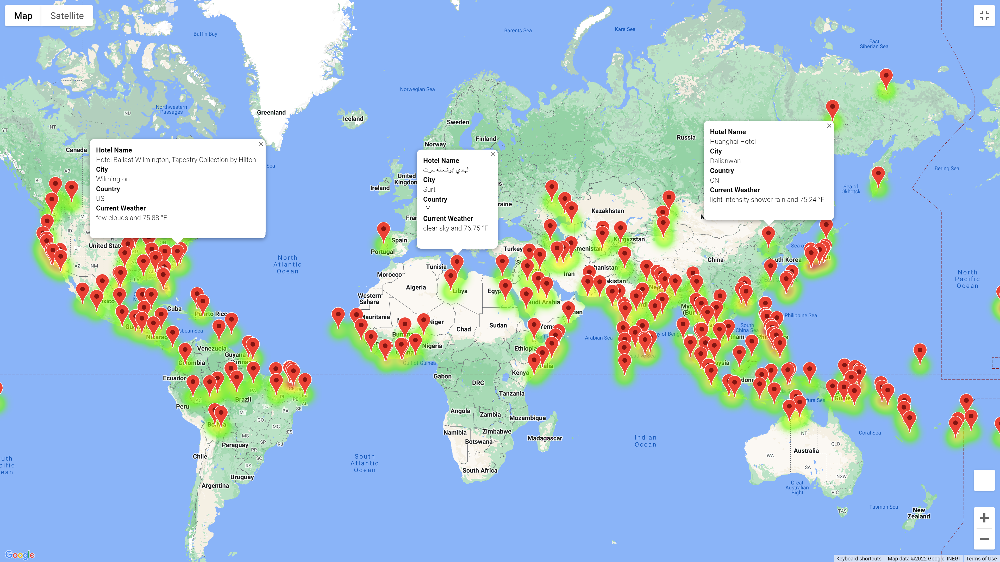
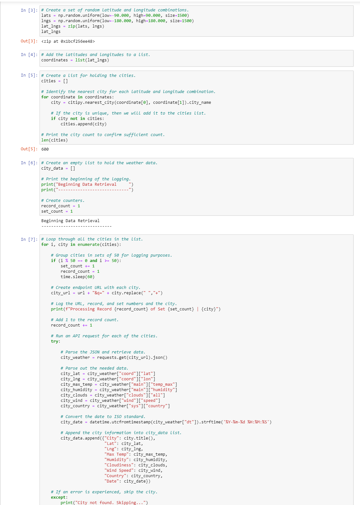
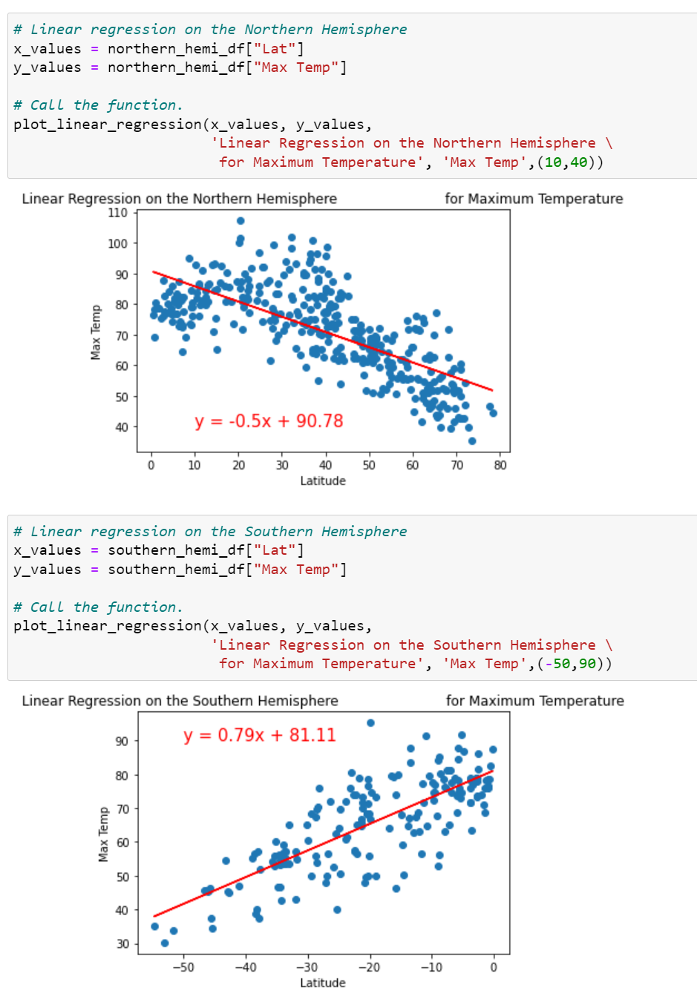
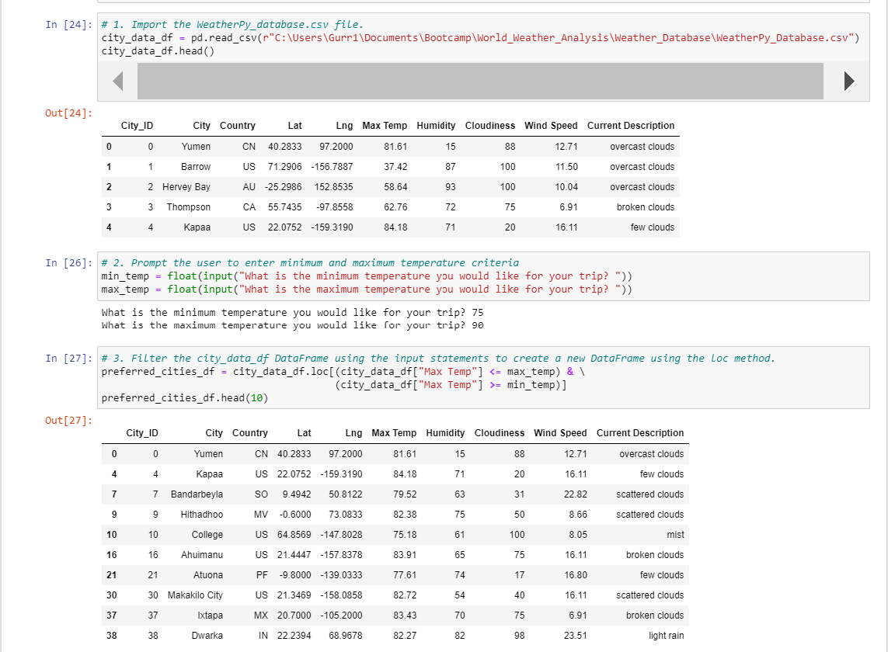
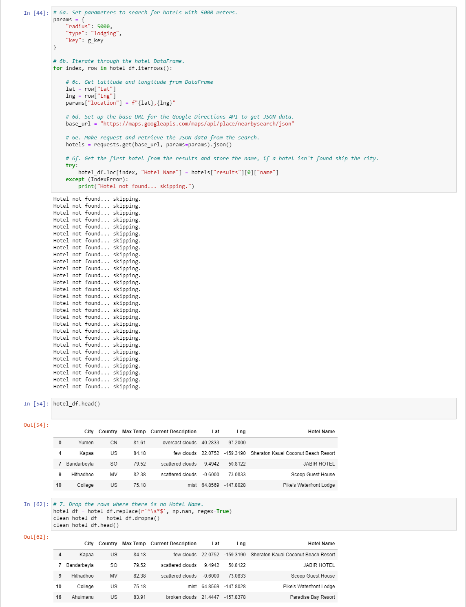
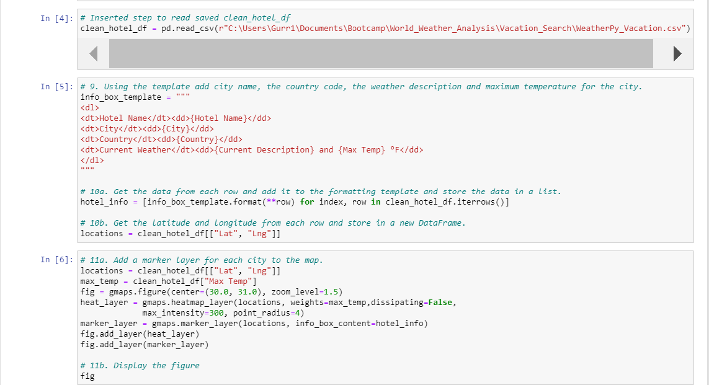
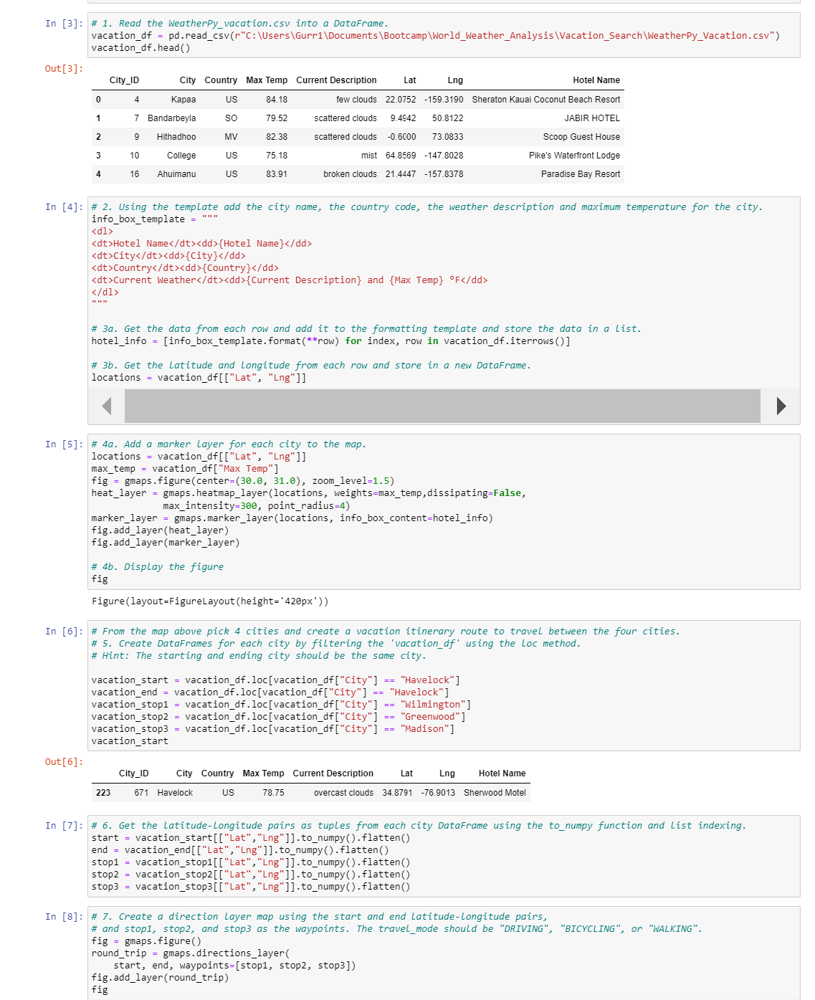
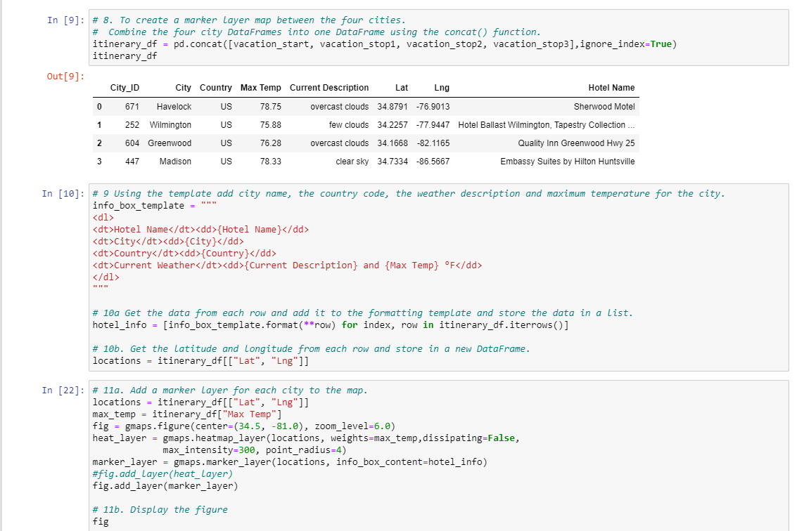

# World Weather Analysis

## Overview of World Weather Analysis

Plan My Trip is top online travel company that specializes in the hotel and lodging industry.  Jack, the head of analysis of the user interface team at Plan My Trip, engaged me to help him collect and present data for customers via the search page.  The customers will filter their searches based on their preferred travel criteria in order to find their ideal hotel anywhere in the world. 
 
### Resources

* Data Source:  city_data.csv, ride_data.csv
* Software:  Python 3.6.1, Jupyter Notebook (anaconda3), Visual Studio Code 1.38.1
* Packages:  Pandas, NumPy, Gmaps, Matplotlib, and CityPy

## World Weather Analysis Methdology

To perform this task, we used the CityPy module to obtain more than 600 cities across the globe using 2,000 randomly generated latitudes and longitudes.  Using the Open Weather Map API, we retrieved the json weather data for each city by name.  The weather data was added to a pandas dataframe, so we could explore the relationships between all of the cities' latitudes and their weather using Matplotlib graphs.

Once the statistical analyses were performed, we created an input script to obtain the travel preferences for each customer.  We used the customer's travel preferences to filter the cities dataset.  Then, we used the Google Places API to create a list of hotels near each city returned for each customer's travel preferences.  Once the hotel data was incoporated into our dataframe, we used the Google Maps API to plot each hotel on a map for the customers to see.

We then used the Google Directions API to chart out the travel itinerary for a particular customers trip.  That information included pins for each destinatation and a list of hotels and current weather for each location.

### Pictures of final results

World Weather Search Map:

Sample Travel Itinerary Map:

Sample Travel Itinerary Map with Markers:

## Code Snippets

Open Weather Map API Call:

Statistical Analysis on Temperatures by Hemisphere:

Customer Input Filter:

Hotel API Search:

World Weather Map Script:

Itinerary Map Script:

Itinerary Marker Map Search:

